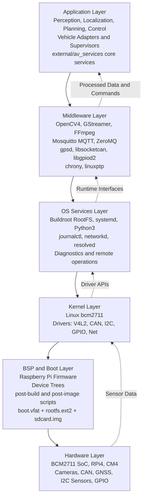
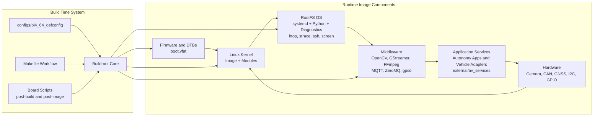

# Software Architecture (SW_ARCH)

## Table of Contents

- [Scope](#scope)
- [Architecture Diagrams](#architecture-diagrams)
	- [Layered Architecture Diagram](#layered-architecture-diagram)
	- [Static Architecture Diagram](#static-architecture-diagram)
- [Static Architecture](#static-architecture)
	- [1. Hardware Platform](#1-hardware-platform)
	- [2. Boot and Board Support Package (BSP)](#2-boot-and-board-support-package-bsp)
	- [3. Kernel Layer](#3-kernel-layer)
	- [4. Core OS Layer](#4-core-os-layer)
	- [5. Middleware and Runtime Services](#5-middleware-and-runtime-services)
	- [6. Application and Integration Layer](#6-application-and-integration-layer)
	- [7. Operations and Diagnostics Layer](#7-operations-and-diagnostics-layer)
- [Layered Architecture View](#layered-architecture-view)
- [Cross-Layer Data Paths](#cross-layer-data-paths)
	- [Perception Path](#perception-path)
	- [Vehicle Bus Path](#vehicle-bus-path)
	- [Timing and Sync Path](#timing-and-sync-path)
- [Build-Time Structural Artifacts](#build-time-structural-artifacts)
- [Constraints and Next Architecture Steps](#constraints-and-next-architecture-steps)

## Scope

This document describes the static and layered software architecture for the Raspberry Pi 4 Buildroot image configured in this repository.

Target profile:
- Platform: Raspberry Pi 4 / CM4 class boards (64-bit)
- Build system: Buildroot
- Primary use case: Autonomous vehicle edge compute baseline

## Architecture Diagrams

### Layered Architecture Diagram

### Static Architecture Diagram

## Static Architecture

### 1. Hardware Platform

- SoC: Broadcom BCM2711 (ARM Cortex-A72)
- Board targets: RPi 4B, RPi 400, CM4, CM4S
- Typical I/O used by this image:
- CSI/USB cameras for perception
- CAN interfaces for vehicle network
- I2C buses for sensors
- GPIO for control/status lines
- Ethernet/Wi-Fi for telemetry and remote operations

### 2. Boot and Board Support Package (BSP)

- Firmware: Raspberry Pi firmware package (PI4 variant)
- Device tree assets for supported boards are generated into boot artifacts.
- Boot image generation:
- boot.vfat (firmware, kernel, DTBs)
- rootfs.ext2 (root filesystem)
- sdcard.img (partitioned deployable image)
- Build hooks:
- Post-build script: board/raspberrypi4-64/post-build.sh
- Post-image script: board/raspberrypi4-64/post-image.sh

### 3. Kernel Layer

- Linux kernel is enabled and built from Raspberry Pi upstream tarball.
- Kernel defconfig baseline: bcm2711
- DT support is enabled for the four target board variants.
- Kernel module management:
- kmod and kmod tools are enabled in userspace

### 4. Core OS Layer

- Root filesystem: ext2/ext4-compatible image
- Init system: systemd (PID 1)
- Logging: journald with `journalctl` CLI
- Network bootstrap: systemd-networkd (DHCP on eth0 by default), systemd-resolved (DNS)
- Remote access: OpenSSH (sshd)
- Diagnostics: htop, strace, man, screen, lshw, util-linux utilities
- System and package toolchain:
- External Bootlin aarch64 glibc toolchain

### 5. Middleware and Runtime Services

Perception and media middleware:
- OpenCV4 (including DNN and Video I/O)
- GStreamer core + base/good plugins
- RTP/RTSP and V4L2 plugin paths enabled
- FFmpeg + ffprobe

Vehicle and sensor middleware:
- CAN: can-utils + libsocketcan
- I2C: i2c-tools
- GPIO: libgpiod2 + tools
- GNSS: gpsd daemon + clients

Communication and telemetry middleware:
- MQTT: mosquitto broker + clients
- Message bus: ZeroMQ

Time synchronization middleware:
- chrony
- linuxptp

### 6. Application and Integration Layer

Current image focus:
- Provides runtime dependencies and system tools for autonomy applications.
- Full AV runtime stack with systemd service management.
- Production-grade service lifecycle, logging, and crash recovery.

Integrated application/service package:
- `external/av_services` submodule adds AV core service processes:
  - `av-core-orchestrator`: Main coordinator service
  - `av-core-gateway`: Vehicle interface service
  - `av-core-health`: System health monitor
  - `av-core-logger`: Event logger service
  - `av-core-ota`: OTA update mechanism
- Each service is managed by a systemd unit file with:
  - `Restart=on-failure` for automatic crash recovery
  - `WatchdogSec=` to detect and restart hung processes
  - Dependency ordering (`After=`, `Wants=`) for coordinated startup
  - Structured logging to `journalctl`

Expected app responsibilities above this base image:
- Sensor ingestion pipelines (camera/CAN/GNSS)
- Localization and perception services
- Planning and control services
- Vehicle I/O adapters and safety supervisors

### 7. Operations and Diagnostics Layer

- Init and service management: systemd (PID 1), `systemctl`, `journalctl`
- Network and link diagnostics: iproute2, ethtool, tcpdump, iperf3
- System diagnostics: htop, strace, lshw, man pages
- Utilities: lscpu, lsblk, lspci, lsusb, screen (persistent sessions)
- Remote operations: OpenSSH (SSH server and client)
- Python scripting environment: python3, pip, numpy, pyyaml
- Automated boot-time verification: `pi4-feature-check.service`
- Generated runtime report: `/var/log/pi4_feature_report.md`

## Layered Architecture View

Top-to-bottom layered model:

1. Application Layer
- Mission logic
- Perception, localization, planning, control applications
- Vehicle-specific adapters and supervisors

2. Middleware Layer
- Computer vision and media: OpenCV4, GStreamer, FFmpeg
- Messaging: Mosquitto (MQTT), ZeroMQ
- Device middleware: gpsd, libsocketcan, libgpiod2
- Time services: chrony, linuxptp

3. OS Services Layer
- systemd userland and service management
- Process, filesystem, network, DNS, and startup services
- systemd-networkd/systemd-resolved with DHCP-based basic network initialization
- Boot-time feature validation and reporting via `pi4-feature-check.service`

4. Kernel Layer
- Linux kernel (bcm2711 baseline)
- Driver model for network, V4L2, GPIO, I2C, and CAN interfaces
- Device tree driven board abstraction

5. BSP and Boot Layer
- Raspberry Pi firmware and board boot configuration
- Post-build and post-image integration scripts
- Image composition (boot.vfat, rootfs.ext2, sdcard.img)

6. Hardware Layer
- BCM2711 CPU and board peripherals
- Cameras, CAN transceivers, GNSS receivers, and sensor interfaces

## Cross-Layer Data Paths

### Perception Path

- Camera input via V4L2
- GStreamer/OpenCV processing
- Application-level inference or tracking
- Telemetry and event publication via MQTT/ZeroMQ

### Vehicle Bus Path

- CAN frames through kernel CAN stack
- User-space access via socketcan/can-utils/libsocketcan
- Application consumption for state estimation and control

### Timing and Sync Path

- Network/PTP sources into chrony/linuxptp
- System time discipline for timestamp alignment across sensors and logs

## Build-Time Structural Artifacts

Generated artifacts in output/images represent architecture boundaries:
- Image: Linux kernel binary
- DTBs: Board hardware descriptions
- boot.vfat: Boot and firmware partition
- rootfs.ext2: OS + middleware + runtime userspace
- sdcard.img: Deployable integrated system image

## Constraints and Next Architecture Steps

Current constraints:
- This is a baseline platform image, not a complete AD software stack.
- Functional safety partitioning and watchdog/supervisor policies are not yet formally modeled.

Recommended next steps:
1. Add a dedicated application service layer layout (systemd/openrc service map or custom init graph).
2. Define interface contracts per subsystem (camera, CAN, GNSS, control outputs).
3. Add observability architecture (structured logs, metrics, trace IDs, time sync validation).
4. Add deployment profiles for dev/test/vehicle with reproducible Buildroot defconfigs.
