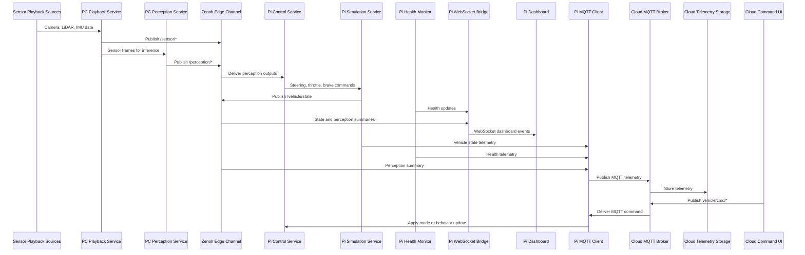
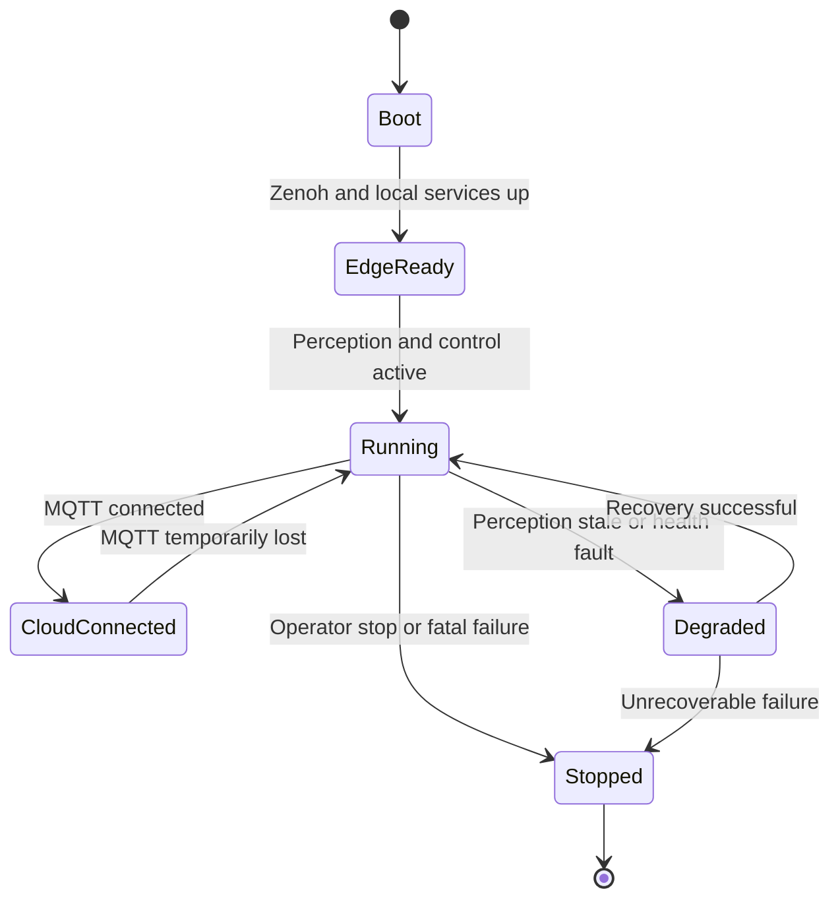

# Dynamic Software Architecture V1

## Overview

This document describes the runtime behavior of the distributed autonomous vehicle simulation across the PC, Raspberry Pi 4, and cloud. It focuses on interaction sequences, control flow, and operational modes rather than static allocation.

## 1. Runtime Scenarios Covered

This dynamic view covers:

1. Edge perception to control loop
2. Dashboard update flow on the Pi
3. Telemetry upload to the cloud
4. Remote command handling from cloud to Pi
5. Failure and degraded-mode behavior

## 2. Dynamic Runtime Context

At runtime:

- The PC continuously replays sensor inputs and computes perception outputs
- The Pi continuously converts perception into simulated control and vehicle state
- The Pi periodically publishes telemetry to cloud services
- The cloud may asynchronously send operator commands back to the Pi

## 3. Main Dynamic Interaction Diagram

## 4. Edge Control Loop Behavior

### 4.1 Nominal Flow

1. Playback service reads next sensor samples
2. Perception service executes inference on current data window
3. Perception results are published over Zenoh
4. Pi control service consumes perception outputs
5. Pi control computes steering, throttle, and brake
6. Pi simulation updates state from control actions
7. New vehicle state is published and exposed to observers

### 4.2 Timing Characteristics

- Sensor playback and perception run continuously on the PC
- Control and simulation run continuously on the Pi
- The control loop should not depend on cloud availability
- Dashboard refresh is downstream of the Pi runtime state and health data

## 5. Pi Dashboard Runtime Flow

### 5.1 Dashboard Event Path

1. Pi WebSocket bridge subscribes to state, health, and perception summary sources
2. Bridge normalizes runtime data for browser consumption
3. Dashboard browser receives WebSocket events
4. Browser updates speed, steering, object count, and health panels

### 5.2 Dashboard Behavior Constraints

1. Dashboard is observational, not the primary control path
2. Loss of dashboard must not affect simulation continuity
3. Bridge may downsample or summarize data for lightweight rendering

## 6. Cloud Telemetry Flow

### 6.1 Telemetry Publication

The Pi publishes these logical payload groups:

- Vehicle state telemetry
- Health telemetry
- Perception summary telemetry

### 6.2 Cloud Processing Flow

1. MQTT broker receives telemetry publications
2. Ingestion service validates and forwards records
3. Time-series storage persists data
4. Dashboards and analytics query the stored data

### 6.3 Telemetry Behavior Constraints

1. Telemetry publication is periodic or event-driven, but not part of hard real-time control
2. Temporary cloud failures should not stop local control and simulation
3. Telemetry backlog or retry logic should be isolated from the control loop

## 7. Remote Command Flow

### 7.1 Command Sequence

1. Operator uses cloud UI or API
2. Cloud publishes command on `vehicle/cmd/*`
3. Pi MQTT command listener receives the command
4. Pi validates the command payload
5. Pi control service updates mode, triggers reset, fault injection, or replay behavior
6. Pi reflects resulting changes in telemetry and dashboard state

### 7.2 Command Safety Rules

1. Commands must be explicit and typed
2. Invalid commands must be rejected without destabilizing runtime
3. Command handling must be auditable through telemetry or logs

## 8. Degraded and Failure Modes

### 8.1 Cloud Disconnected

Behavior:
- Pi continues local control and simulation
- Dashboard continues serving local state
- Telemetry uplink is degraded or buffered
- Remote commands are unavailable until reconnect

### 8.2 PC Perception Delayed or Unavailable

Behavior:
- Pi control may enter fallback mode
- Last-known perception may be aged out
- Health and state telemetry should expose degraded mode

### 8.3 Dashboard Client Disconnected

Behavior:
- WebSocket bridge remains available for future clients
- Core control and telemetry continue unaffected

### 8.4 MQTT Broker Unavailable

Behavior:
- Cloud storage and remote command path are unavailable
- Edge loop remains active if Zenoh path remains healthy

## 9. Operational State Machine

## 10. Dynamic Allocation Summary

| Runtime Concern | Primary Runtime Owner |
|---|---|
| Sensor timing and replay | PC playback service |
| Perception inference cadence | PC perception service |
| Closed-loop control decision | Pi control service |
| Vehicle state evolution | Pi simulation service |
| Health observation | Pi health monitor |
| Local operator visibility | Pi WebSocket bridge and dashboard |
| Telemetry uplink | Pi MQTT client |
| Historical observability | Cloud ingestion and storage |
| Remote operations | Cloud command UI and Pi command listener |

## 11. Key Dynamic Architecture Properties

1. The edge control loop is local to PC and Pi, not cloud-coupled
2. The Pi is the control authority in V1
3. Cloud interaction is asynchronous relative to the real-time edge loop
4. The dashboard is a derived operational view of Pi-owned runtime data
5. Failure isolation is achieved by separating Zenoh edge transport from MQTT cloud transport
