# Functional System Architecture Diagram V1

## Overview

This diagram shows functional allocation across sensors, PC, Raspberry Pi 4, and cloud, along with the major data flows and interface technologies.

## Functional System Diagram

```mermaid
flowchart LR
    subgraph SENSORS[Sensor Sources]
        CAM[Camera Logs or Stream]
        LIDAR[LiDAR Logs or Stream]
        IMU[IMU Logs or Stream]
    end

    subgraph PC[Edge Compute Node - Asus Strix G16]
        PLAYBACK[Sensor Playback Service]
        PERCEPTION[GPU Perception Service\nObjects / Lane / Occupancy]
        VIS[Optional Visualization\nRViz / Foxglove / Custom UI]
        ZENOH_PC[Zenoh Client / Publisher]
    end

    subgraph PI[Vehicle Node - Raspberry Pi 4B]
        ZENOH_PI[Zenoh Client / Router]
        CONTROL[Planning and Control Service\nRule-based / PID / Pure Pursuit]
        SIM[Vehicle State Simulation\nSpeed / Steering / Pose / IMU]
        HEALTH[Health Monitor\nCPU / Temp / Memory / Link]
        WSBRIDGE[Zenoh to WebSocket Bridge]
        DASH[Local Web Dashboard]
        MQTT_PI[MQTT Telemetry and Command Client]
    end

    subgraph CLOUD[Cloud Backend]
        MQTT_BROKER[MQTT Broker]
        STORAGE[Telemetry Storage\nInfluxDB / TimescaleDB]
        ANALYTICS[Dashboards and Analytics\nGrafana / Plotly]
        CMDUI[Remote Command API / UI]
    end

    CAM -->|Sensor frames| PLAYBACK
    LIDAR -->|Point clouds| PLAYBACK
    IMU -->|Inertial samples| PLAYBACK

    PLAYBACK -->|/sensor/camera\n/sensor/lidar\n/sensor/imu| ZENOH_PC
    PLAYBACK --> PERCEPTION
    PERCEPTION -->|/perception/objects\n/perception/lane\n/perception/occupancy_grid| ZENOH_PC
    PERCEPTION --> VIS

    ZENOH_PC <-->|Zenoh over Ethernet or Wi-Fi| ZENOH_PI

    ZENOH_PI -->|Perception topics| CONTROL
    CONTROL -->|/vehicle/steering_cmd\n/vehicle/throttle_cmd\n/vehicle/brake_cmd| SIM
    SIM -->|/vehicle/state| ZENOH_PI
    SIM -->|State updates| WSBRIDGE
    HEALTH -->|Health status| WSBRIDGE
    ZENOH_PI -->|Perception summaries| WSBRIDGE
    WSBRIDGE -->|WebSocket| DASH

    SIM -->|vehicle/telemetry/state| MQTT_PI
    HEALTH -->|vehicle/telemetry/health| MQTT_PI
    ZENOH_PI -->|vehicle/perception/summary| MQTT_PI

    MQTT_PI <-->|MQTT over TLS| MQTT_BROKER
    MQTT_BROKER --> STORAGE
    STORAGE --> ANALYTICS
    CMDUI -->|vehicle/cmd/mode\nvehicle/cmd/reset\nvehicle/cmd/fault_inject\nvehicle/cmd/replay| MQTT_BROKER
    MQTT_BROKER --> MQTT_PI
    MQTT_PI -->|Command actions| CONTROL
``` 

## Functional Allocation

| Element | Allocated Functions |
|---|---|
| Sensors | Produce camera, LiDAR, and IMU source data for replay or live ingestion |
| PC | Sensor playback, GPU perception inference, optional heavy visualization, Zenoh publication |
| Raspberry Pi 4 | Perception subscription, planning and control, vehicle state simulation, health monitoring, dashboard serving, MQTT bridge |
| Cloud | MQTT brokering, telemetry ingestion, time-series storage, dashboards, remote command publication |

## Data Products

| Data Product | Producer | Consumer | Interface |
|---|---|---|---|
| `/sensor/camera` | PC playback | PC perception | Zenoh |
| `/sensor/lidar` | PC playback | PC perception | Zenoh |
| `/sensor/imu` | PC playback | PC perception or Pi services | Zenoh |
| `/perception/objects` | PC perception | Pi control, Pi dashboard bridge | Zenoh |
| `/perception/lane` | PC perception | Pi control | Zenoh |
| `/perception/occupancy_grid` | PC perception | Pi control | Zenoh |
| `/vehicle/steering_cmd` | Pi control | Pi simulation | Internal service interface |
| `/vehicle/throttle_cmd` | Pi control | Pi simulation | Internal service interface |
| `/vehicle/brake_cmd` | Pi control | Pi simulation | Internal service interface |
| `/vehicle/state` | Pi simulation | Pi dashboard bridge, edge observers | Zenoh |
| `vehicle/telemetry/state` | Pi | Cloud broker and storage | MQTT |
| `vehicle/telemetry/health` | Pi | Cloud broker and storage | MQTT |
| `vehicle/perception/summary` | Pi | Cloud broker and storage | MQTT |
| `vehicle/cmd/mode` | Cloud UI | Pi | MQTT |
| `vehicle/cmd/reset` | Cloud UI | Pi | MQTT |
| `vehicle/cmd/fault_inject` | Cloud UI | Pi | MQTT |
| `vehicle/cmd/replay` | Cloud UI | Pi | MQTT |

## Interface Summary

| Interface | Path | Purpose |
|---|---|---|
| Zenoh | PC <-> Pi | Low-latency edge transport for sensor, perception, and state data |
| MQTT over TLS | Pi <-> Cloud | Reliable telemetry uplink and remote command downlink |
| WebSocket | Pi bridge -> Browser | Real-time dashboard updates |
| Local service calls | Pi internal | Control-to-simulation and monitor-to-dashboard data movement |

## Notes

1. The PC carries the compute-heavy perception workload.
2. The Pi owns the closed-loop control and simulation behavior.
3. The cloud is not in the real-time edge control path.
4. This separation keeps control responsive even during cloud degradation.
