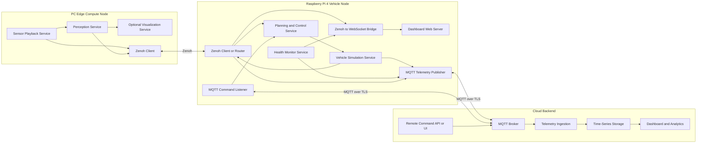

# Static Software Architecture V1

## Overview

This document describes the static software decomposition of the distributed autonomous vehicle simulation across three deployment nodes:

- PC edge compute node
- Raspberry Pi 4 vehicle node
- Cloud backend

The focus is functional allocation, deployable software elements, interface boundaries, and ownership of responsibilities.

## 1. Static View Goals

The static architecture defines:

1. What software components exist
2. Where each component is deployed
3. What interfaces connect the components
4. Which components own data production, control, storage, and visualization

## 2. Deployment Nodes

### 2.1 PC Edge Compute Node

Purpose:
- High-compute replay and perception execution

Allocated software elements:
- Sensor Playback Service
- Perception Service
- Optional Visualization Service
- Zenoh Client Library / Publisher / Subscriber runtime

Primary responsibilities:
- Replay camera, LiDAR, and IMU sources
- Run GPU-heavy perception pipelines
- Publish perception outputs to edge network

### 2.2 Raspberry Pi 4 Vehicle Node

Purpose:
- Edge control, vehicle simulation, health monitoring, local visualization, and cloud bridging

Allocated software elements:
- Zenoh Edge Client / Router
- Planning and Control Service
- Vehicle Simulation Service
- Health Monitor Service
- Zenoh to WebSocket Bridge
- Dashboard Web Server
- MQTT Telemetry Publisher
- MQTT Command Listener

Primary responsibilities:
- Consume perception outputs
- Compute steering, throttle, and brake commands
- Simulate vehicle dynamics and state
- Publish telemetry and consume cloud commands
- Host local runtime dashboard

### 2.3 Cloud Backend

Purpose:
- Remote observability, persistence, and operator control

Allocated software elements:
- MQTT Broker
- Telemetry Ingestion Service
- Time-Series Storage
- Dashboard / Analytics Service
- Remote Command API / UI

Primary responsibilities:
- Receive and broker telemetry
- Persist telemetry history
- Expose dashboards and remote control interfaces

## 3. Static Component Diagram

## 4. Component Responsibilities

### 4.1 PC Components

| Component | Responsibility | Key Outputs |
|---|---|---|
| Sensor Playback Service | Reads recorded or synthetic sensor streams | `/sensor/camera`, `/sensor/lidar`, `/sensor/imu` |
| Perception Service | Executes object, lane, and occupancy inference | `/perception/objects`, `/perception/lane`, `/perception/occupancy_grid` |
| Optional Visualization Service | Displays debugging or analytics views | Local-only views |
| Zenoh Client | Publishes and subscribes edge topics | Zenoh topic transport |

### 4.2 Pi4 Components

| Component | Responsibility | Key Outputs |
|---|---|---|
| Zenoh Client or Router | Edge messaging endpoint | Perception ingestion, state publication |
| Planning and Control Service | Computes control actions from perception inputs | Steering, throttle, brake commands |
| Vehicle Simulation Service | Updates simulated state and motion | `/vehicle/state`, telemetry state payload |
| Health Monitor Service | Tracks CPU, memory, temperature, and network health | Health telemetry |
| Zenoh to WebSocket Bridge | Adapts internal runtime data for browser clients | WebSocket dashboard events |
| Dashboard Web Server | Serves local operator UI | Browser-accessible dashboard |
| MQTT Telemetry Publisher | Publishes state and health to cloud | `vehicle/telemetry/*`, `vehicle/perception/summary` |
| MQTT Command Listener | Receives remote control commands | Mode changes, reset, replay, fault actions |

### 4.3 Cloud Components

| Component | Responsibility | Key Outputs |
|---|---|---|
| MQTT Broker | Brokers telemetry and command topics | MQTT routing |
| Telemetry Ingestion | Validates and transforms inbound telemetry | Stored measurement records |
| Time-Series Storage | Persists state and health history | Queryable telemetry history |
| Dashboard and Analytics | Visualizes current and historical behavior | Graphs, dashboards, alerts |
| Remote Command API or UI | Issues operator commands | MQTT command publications |

## 5. Interface Boundaries

### 5.1 PC to Pi4 Boundary

Transport:
- Zenoh

Exposed interfaces:
- `/sensor/*`
- `/perception/*`
- `/vehicle/state`

Boundary rule:
- The PC does not directly own control or simulation decisions.
- The Pi4 does not directly run heavy GPU perception.

### 5.2 Pi4 to Cloud Boundary

Transport:
- MQTT over TLS

Exposed interfaces:
- `vehicle/telemetry/state`
- `vehicle/telemetry/health`
- `vehicle/perception/summary`
- `vehicle/cmd/*`

Boundary rule:
- Cloud is not in the real-time control loop.
- Pi4 remains autonomous for edge control if cloud is unavailable.

### 5.3 Pi4 Local UI Boundary

Transport:
- WebSocket for live data
- HTTP for dashboard content delivery

Boundary rule:
- Dashboard is read-mostly operational visualization.
- Runtime decisions remain within Pi4 control and simulation services.

## 6. Data Ownership

| Data | Owner | Secondary Consumers |
|---|---|---|
| Sensor stream data | PC playback | PC perception |
| Perception outputs | PC perception | Pi4 control, Pi4 dashboard bridge |
| Control commands | Pi4 control service | Pi4 simulation |
| Vehicle state | Pi4 simulation | Zenoh edge peers, dashboard bridge, cloud telemetry |
| Health status | Pi4 health monitor | Dashboard bridge, cloud telemetry |
| Historical telemetry | Cloud storage | Dashboards, operators, analytics |
| Remote commands | Cloud command service | Pi4 command listener |

## 7. Static Architecture Constraints

1. Perception remains compute-heavy and PC-local in V1.
2. Control and simulation remain Pi-local in V1.
3. Cloud services do not participate in hard real-time edge decisions.
4. All cross-node interfaces must remain message-oriented and versionable.
5. Pi-hosted dashboard must continue operating without cloud dependency.

## 8. Benefits of This Static Partitioning

1. Clear separation between perception, control, and cloud concerns
2. Easier scaling of cloud services without destabilizing edge runtime
3. Easier replacement of PC perception pipelines without rewriting Pi control stack
4. Stronger fault isolation between real-time edge loop and remote observability stack
